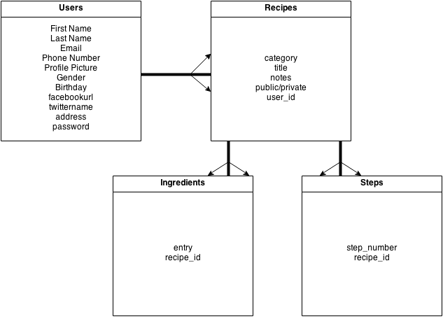

### A cooking app that listens and speaks to you!

* Sign in to your account and create new recipes
* The recipes can easily be accessed from your profile page
* Click on the recipe that you would like to cook
* The Recipe page will show you the ingredients and the steps
* Upon clicking Begin, Recispeak will prompt you to allow your microphone
* On the command Next, it will read you the next step
* On the command Beginning, it will start over at the very beginning
* On the command Repeat, it will repeat the step to you
* On the command Back, it will go one step back

###API's
* Google Chrome Web Speech Synthesis
* Google Chrome Web Speech Recognition

##### Future Additions
* Food2Fork
* Yummly

####ERD For Recispeak

##### Link to Recispeak's User Stories on Pivotal Tracker 
[Click Here](https://www.pivotaltracker.com/s/projects/1049036)

Link to the application
[Recispeak](http://recipespeak.herokuapp.com)